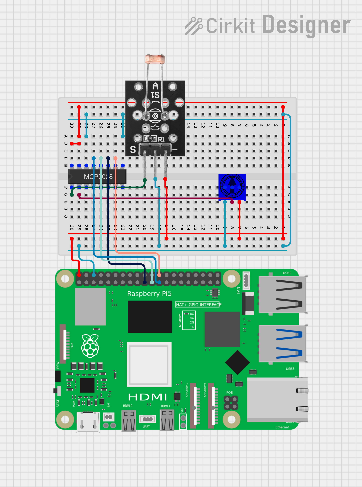

# RasPi A

## Venv Setup
* install venv
    ```
    sudo apt install python3-venv -y
    ```
* create venv
    ```
    python3 -m venv .venv
    ```
* start venv
    ```
    source .venv/bin/activate
    ```
* install dependencies
    ```
    pip install -r requirements.txt
    ```

## SPI Setup
* Open the firmware config file
    ```
    sudo nano /boot/firmware/config.txt
    ```
* Scroll to the bottom and add this line:
    ```
    dtoverlay=spi0-1cs
    ```
* Reboot
    ```
    sudo reboot
    ```
* After reboot, check devices
    ```
    ls /dev/spi*
    ```
    You should now see:
    ```
    /dev/spidev0.0
    ```

## Circuit Diagram


## Parts List
* Raspberry Pi 5
* [MCP3208 ADC](https://ww1.microchip.com/downloads/aemDocuments/documents/APID/ProductDocuments/DataSheets/21298e.pdf)
* [KY-018 LDR](https://www.datasheethub.com/wp-content/uploads/2022/10/KY-018-Joy-IT.pdf)
* [TSR-3386 Potentiometer](https://cdn.sparkfun.com/assets/2/b/1/1/7/TSR-3386.pdf)