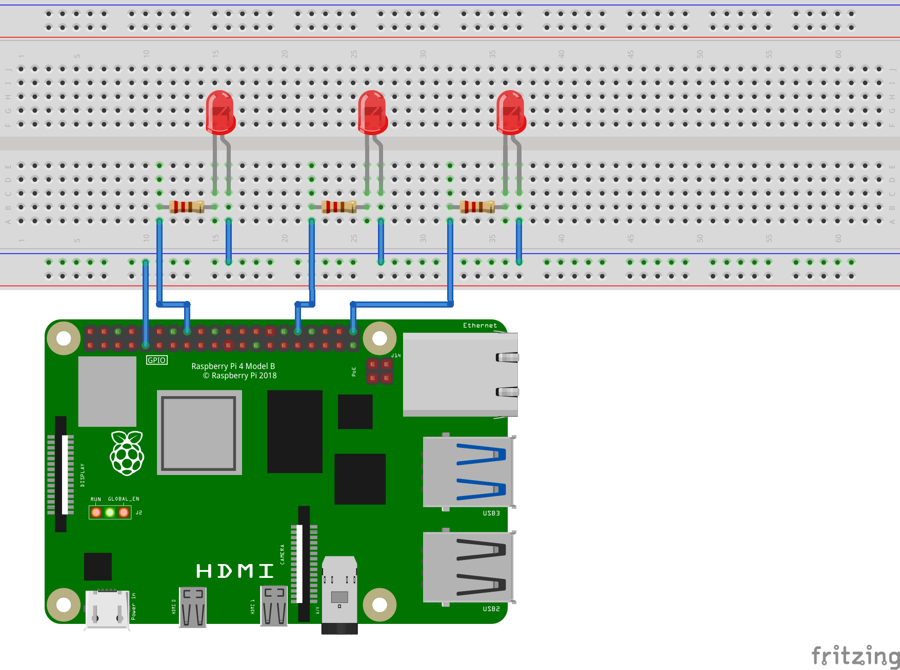

# RasPi B

## Prerequisites
- Raspberry Pi (4+)
- 3 LEDs
- 3 220 ohms resistors (any resistor will do)

### Packages

```bash
# Create a virtual environment to any desired location
cd /Documents/{your_project_name}

# Make sure to use --system-site-packages flag
python3 -m venv --system-site-packages {your_env_name}
source {your_env_name}/bin/activate

# If the package is not installed, install it
pip3 install gpiozero paho-mqtt 
```

### Wiring Diagram

- Feel free to use any GPIO pins for your LEDs.
- For our code, we used GPIO 16, 20, 21.

## Running the code
Change the broker host and port to your broker host and port
```python
BROKER_HOST = {your_broker_host}
BROKER_PORT = {your_broker_port}
```

Move the code to the raspberry pi if necessary. Then, run the code
```bash
python3 pi_b.py
```

## Testing the code
Have mosquitto-clients installed on your raspberry pi.
```bash
pip3 install mosquitto-clients
```

Run the code on a terminal and raspberry pi. 
You should see repeated messages on the terminal of offline status.
```bash
# Terminal 1
python3 pi_b.py
```

Pull up another terminal and run the following commands
```bash
# Terminal 2
mosquitto_sub -h localhost -t "Status/RaspberryPiA" -m "online" 
```


